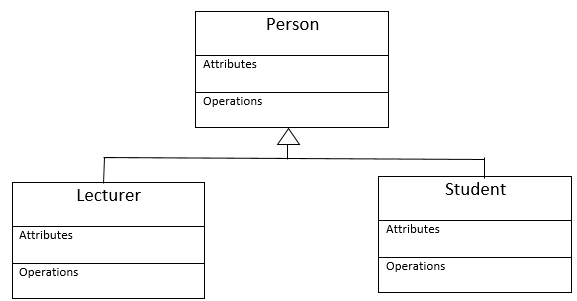

# Workout app
### Kecskemeti Eduard-Alexandru

## Descriere
Aplicația urmărește să ajute utilizatorul în urmărirea progresului de-a lungul antrenamentelor la sală,aplicația va include:
-observe progresul pentru fiecare exercițiu dintr-un antrenament
-Tracker pentru macronutrienți,care vine cu o sugestie pentru un număr ideal de calorii atât pentru diete de creștere cât și de scădere in greutate,bazată pe indexul de masă al utlizatorului și de nivelul său de activitate
-Sugestii pentru programe de antrenament(atât split-uri de antrenament cât și exerciții pentru fiecare antrenament) 
-Arată  grupele musculare lucrate în fiecare săptămână(va afișa volumul pentru fiecare grupă bazat pe numărul de seturi introduse de utilizator pe parcursul săptămânii)
-Explică execuția corectă pentru fiecare exercițiu
-Un sistem de tip "achievement" pentru diverse milestone-uri pe care utilizatorul le atinge (ex: 14 zile de antrenament consecutiv,genuflexiuni cu 100kg,1000 de seturi executate în total etc.)

## Obiective
Aplicația urmărește să rezolve problema ..

* ob1
* ob2
* ob3
    - sob31
    - sob32
    - ...
* ....

## Arhitectura
Lorem ipsum ...

Lorem ipsum ...

## Functionalitati/Exemple utilizare
Lorem ipsum

### Resurse
Markdown Guide, [Online] Available: https://www.markdownguide.org/basic-syntax/ [accesed: Mar 14, 1706]
